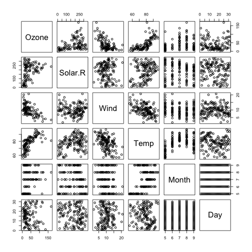
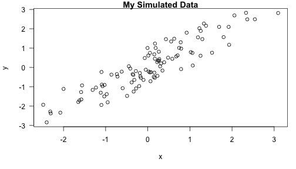

Videos Week 2 
========================================================

## Video 2
**bold**

- unordered list
- some list

[Some Link](http://www.google.com)

or some other link type

I spend some much time reading [R Bloggers][1] and [Simply Statistic][2]!
[1]: http://www.r-bloggers.com/ "R Bloggers" 
[2]: http://simplystatistics.org/ "Simply Stats"


## Video 3
### R Mark Down
The idea is it is a minimal document langauge that allows users to focus on the content and not worry about the formatting.

knitr evaluates the R code before making an HTML document. Markdown will not evaluate the R code.

you can write slides presentation in R markdown. You call slidify package to make presentation.

install.packages("slidify")


## Video 4
### Markdown Demonstration

```r
library(datasets)
data(airquality)
pairs(airquality)
```

 


```r
library(stats)
fit <- lm(Ozone ~ Wind + Solar.R + Temp, data = airquality)
summary(fit)
```

```
## 
## Call:
## lm(formula = Ozone ~ Wind + Solar.R + Temp, data = airquality)
## 
## Residuals:
##    Min     1Q Median     3Q    Max 
## -40.48 -14.22  -3.55  10.10  95.62 
## 
## Coefficients:
##             Estimate Std. Error t value Pr(>|t|)    
## (Intercept) -64.3421    23.0547   -2.79   0.0062 ** 
## Wind         -3.3336     0.6544   -5.09  1.5e-06 ***
## Solar.R       0.0598     0.0232    2.58   0.0112 *  
## Temp          1.6521     0.2535    6.52  2.4e-09 ***
## ---
## Signif. codes:  0 '***' 0.001 '**' 0.01 '*' 0.05 '.' 0.1 ' ' 1
## 
## Residual standard error: 21.2 on 107 degrees of freedom
##   (42 observations deleted due to missingness)
## Multiple R-squared:  0.606,	Adjusted R-squared:  0.595 
## F-statistic: 54.8 on 3 and 107 DF,  p-value: <2e-16
```


## Video 5
### Knitr PART 1
Weave doc to make human readable
Tangle to produce a computer code

**Pros**
- Text and code are in same spot
- Data results automatically update to reflect change
- code is live and is "regression test"

**Con**
- Text and code is in one place especially if there is a lot of code
- If lengthy processing time that will slow down rendering the document


## Video 6
### Knitr PART 2
Good for reports if you have to generate them periodically. You can generate new summary statistics

knitr is not good for:
- long research articles
- complex and time-consuming computations
- Documents that require precise formatting

## Video 7
### Knitr PART 3
My First knitr document

```r
myCodeChunk <- 1
```


My First knitr document


## Video 8
### Knitr PART 4
**knitr to HTML Process**  
.Rmd -> .md -> .html

**In Knitr you can calculate a value then later embed it in your text like this**  


The current time is **Sun Jun 08 21:33:52 2014**. Note: this is an embedded calculated value in bold.

knitr embeds your plot as a base64 hex 


#### Set Global Options for Code Chunks


First simulate data

```r
x <- rnorm(100)
y <- x + rnorm(100, sd = 0.5)
```

_Notice there is no results from this simulation here!_  
  
Here is a scatter plot of the data.

 


